# CI/CD Pipeline Documentation

This document explains the complete CI/CD pipeline setup for Nuxt Fullstack MCP, including automated testing, Docker image building, NPM publishing, and release management.

## 🔄 Pipeline Overview

The CI/CD pipeline consists of three main workflows:

1. **Docker Build and Push** - Continuous integration for Docker images
2. **Release Management** - Automated releases with NPM publishing
3. **Manual Deployment** - On-demand deployment scripts

## 🐳 Docker Build and Push Workflow

**File**: `.github/workflows/docker-build.yml`

### Triggers

```yaml
on:
  push:
    branches: [main, master, develop]  # Push to main branches
  pull_request:
    branches: [main, master]           # PRs to main branches
```

### Workflow Jobs

#### 1. Test Job
**Purpose**: Run comprehensive test suite before any deployment

**Steps**:
- ✅ Setup Node.js and pnpm
- ✅ Install dependencies
- ✅ Run ESLint (`pnpm lint`)
- ✅ Run TypeScript check (`pnpm typecheck`)
- ✅ Run unit tests (`pnpm test`)
- ✅ Run integration tests (`pnpm test:integration`)
- ✅ Determine deployment conditions

**Outputs**:
- `should-deploy`: Boolean indicating if Docker push should happen
- `image-tag`: Tag to use for Docker image

#### 2. Docker Build Job
**Purpose**: Build, test, and optionally push Docker images

**Conditional Logic**:
```bash
# Push to Docker Hub ONLY if:
- Tests pass AND
- Event is push (not PR) AND  
- Branch is main or master
```

**Steps**:
- 🐳 Setup multi-platform Docker Buildx
- 🔐 Login to Docker Hub (if deploying)
- 📦 Build Docker image (multi-platform if deploying)
- 🧪 Test Docker container
- 📊 Generate deployment summary

### Image Tagging Strategy

| Branch/Event | Docker Tag | Push to Hub | Notes |
|--------------|------------|-------------|-------|
| PR | `test` | ❌ No | Local build only |
| `develop` | `dev` | ✅ Yes | Development builds |
| `main/master` | `latest` | ✅ Yes | Production builds |
| Git tag `v*` | Version number | ✅ Yes | Release builds |

### Environment Variables

```yaml
env:
  REGISTRY: docker.io                    # Docker registry
  IMAGE_NAME: nuxt-fullstack-mcp         # Image name
```

## 🚀 Release Management Workflow

**File**: `.github/workflows/release.yml`

### Triggers

```yaml
on:
  push:
    tags: ['v*']           # Git tags starting with 'v'
  workflow_dispatch:       # Manual trigger
    inputs:
      version: string      # Version to release
```

### Workflow Jobs

#### 1. Test Job
Same comprehensive testing as Docker workflow

#### 2. NPM Publish Job
**Purpose**: Publish packages to NPM registry

**Requirements**:
- All tests must pass
- Valid NPM token configured
- Proper package versioning

**Features**:
- Publishes with provenance for supply chain security
- Uses `--access public` for public packages
- Recursive publishing (`-r`) for monorepo

#### 3. Docker Publish Job
**Purpose**: Build and push production Docker images

**Features**:
- Multi-platform builds (AMD64, ARM64)
- Version-specific tags
- Latest tag for main branch
- Comprehensive metadata

#### 4. GitHub Release Job
**Purpose**: Create GitHub release with changelog

**Features**:
- Automatic changelog generation using `changelogithub`
- Docker deployment instructions
- NPM installation instructions
- Quick start guide

## 🔧 Manual Scripts

### Release Script

**File**: `scripts/release.sh`

**Usage**:
```bash
./scripts/release.sh 2.0.0
```

**Features**:
- ✅ Semantic version validation
- ✅ Git branch and status checks
- ✅ Complete test suite execution  
- ✅ Automatic version updates
- ✅ CHANGELOG.md updates
- ✅ Git tag creation and pushing
- ✅ Local Docker build testing

### Docker Push Script

**File**: `scripts/docker-push.sh`

**Usage**:
```bash
./scripts/docker-push.sh 2.0.0 latest
```

**Features**:
- 🐳 Multi-platform Docker builds
- 📦 Push to Docker Hub
- 🧪 Container validation testing
- 📊 Deployment summary

## 📋 Pipeline Execution Flow

### Pull Request Flow


### Main Branch Push Flow

```mermaid
graph TD
    A[Push to main/master] --> B[Run Full Test Suite]
    B --> C{Tests Pass?}
    C -->|No| D[❌ Fail Pipeline]
    C -->|Yes| E[Build Multi-Platform Image]
    E --> F[Push to Docker Hub]
    F --> G[Test Pushed Image]
    G --> H[Generate Deployment Summary]
    H --> I[✅ Success]
```



### Release Flow

```mermaid
graph TD
    A[Git Tag v*] --> B[Run Tests]
    B --> C{Tests Pass?}
    C -->|No| D[❌ Fail Pipeline]
    C -->|Yes| E[Publish to NPM]
    E --> F[Build Docker Images]
    F --> G[Push to Docker Hub]
    G --> H[Create GitHub Release]
    H --> I[Update Release Notes]
    I --> J[✅ Complete Release]
```



## 🛡️ Security Measures

### Secret Management
- All sensitive tokens stored as GitHub Secrets
- Minimal required permissions for tokens
- Automatic token rotation reminders
- No secrets exposed in logs

### Build Security
- Pinned action versions for reproducibility
- Multi-platform builds for security
- Container scanning (can be added)
- Provenance tracking for NPM packages

### Access Control
- Branch protection rules enforced
- Required status checks before merge
- Pull request reviews required
- Automated security updates

## 📊 Monitoring and Observability

### GitHub Actions Insights
- Workflow run history
- Success/failure rates
- Performance metrics
- Resource usage tracking

### Deployment Summaries
Each successful deployment generates a summary with:
- 📦 Image tags and registry links
- 🚀 Quick start commands
- 📊 Workflow links
- 🔗 Docker Hub links

### Notifications
- GitHub status checks on PRs
- Email notifications for failed runs
- Slack integration (can be configured)
- Discord webhooks (can be configured)

## 🐛 Troubleshooting

### Common Pipeline Issues

#### 1. Test Failures
```bash
# Check specific test output
GitHub Actions → Failed workflow → Test job → View logs

# Run tests locally
pnpm install
pnpm lint
pnpm typecheck  
pnpm test
pnpm test:integration
```

#### 2. Docker Build Failures
```bash
# Check build context
ls -la .dockerignore

# Test build locally
docker build -t nuxt-fullstack-mcp:test .
docker run -p 3000:3000 nuxt-fullstack-mcp:test
```

#### 3. Docker Push Authentication
```bash
# Verify secrets are set correctly
Repository Settings → Secrets and variables → Actions

# Test credentials locally
echo "$DOCKERHUB_TOKEN" | docker login docker.io -u "$DOCKERHUB_USERNAME" --password-stdin
```

#### 4. NPM Publishing Issues
```bash
# Check NPM token permissions
npm whoami --registry https://registry.npmjs.org/

# Verify package.json configuration
cat package.json | grep -E "(name|version|private)"
```

### Pipeline Debugging

#### Enable Debug Logging
Add to workflow environment:
```yaml
env:
  ACTIONS_STEP_DEBUG: true
  ACTIONS_RUNNER_DEBUG: true
```

#### Check Workflow Status
```bash
# Via GitHub CLI
gh run list --repo owner/repo
gh run view RUN_ID --repo owner/repo

# Via API
curl -H "Authorization: token $GITHUB_TOKEN" \
  https://api.github.com/repos/owner/repo/actions/runs
```

## 🔄 Pipeline Optimization

### Performance Improvements
- ✅ Dependency caching for faster builds
- ✅ Docker layer caching for image builds  
- ✅ Parallel job execution where possible
- ✅ Conditional execution to skip unnecessary steps

### Resource Efficiency
- ✅ Multi-stage Docker builds
- ✅ Build artifact reuse between jobs
- ✅ Optimized GitHub Actions usage
- ✅ Efficient test execution order

### Cost Optimization
- ✅ Skip builds on documentation-only changes
- ✅ Conditional Docker pushes
- ✅ Efficient use of GitHub Actions minutes
- ✅ Smart caching strategies

## 📈 Future Enhancements

### Planned Improvements
- [ ] Container vulnerability scanning
- [ ] Performance regression testing
- [ ] Automated dependency updates
- [ ] Multi-environment deployments
- [ ] Integration with monitoring tools
- [ ] Advanced notification systems

### Integration Opportunities
- [ ] Slack/Discord notifications
- [ ] Jira/Linear issue linking
- [ ] Datadog/New Relic monitoring
- [ ] Sentry error tracking
- [ ] CloudWatch/Prometheus metrics

---

**Related Documentation**:
- [GitHub Environment Setup](./GITHUB_ENVIRONMENT_SETUP.md)
- [Deployment Guide](./DEPLOYMENT.md)
- [Main README](../README.md)